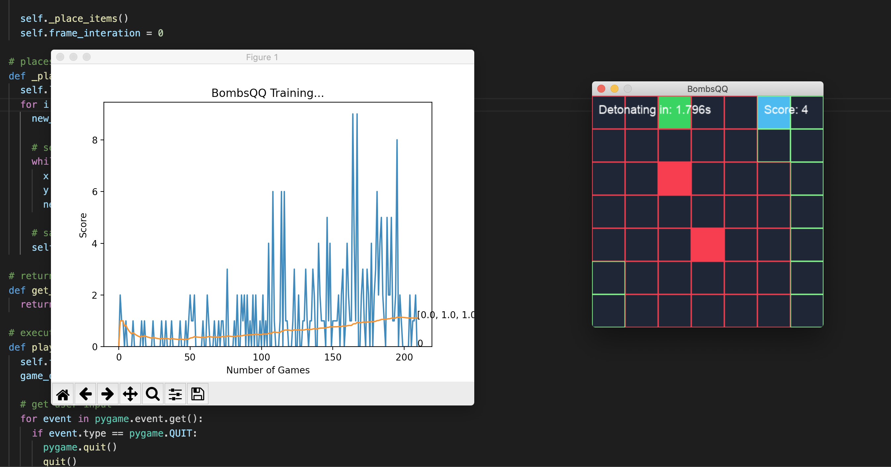
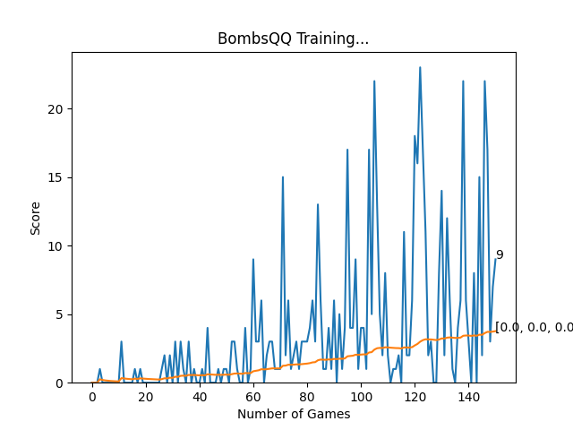

# BombsQQ
A Pygame and PyTorch reinforcement learning project by Nathan Nguyen

[Video Demo](https://youtu.be/GtXHwYDo_ag)

## What is BombsQQ?
*BombsQQ*, named in reference to Deep Q Learning, is a grid based game. There are four items on the grid: the player (blue), two bombs (red), and one civilian (green). In order to complete a round, the player must retrieve the civilian and retreat outside the bombs' danger zone before they detonate.

## References
- [Python Engineer/Patrick Loeber on YouTube](https://www.youtube.com/watch?v=PJl4iabBEz0&list=PLqnslRFeH2UrDh7vUmJ60YrmWd64mTTKV)
- [How to teach AI to play Games: Deep Reinforcement Learning by Mauro Comi](https://towardsdatascience.com/how-to-teach-an-ai-to-play-games-deep-reinforcement-learning-28f9b920440a)
- [Neural Networks and Deep Learning by Michael Nielsen](http://neuralnetworksanddeeplearning.com/chap1.html)
- [How to Configure the Learning Rate When Training Deep Learning Neural Networks by Jason Brownlee](https://machinelearningmastery.com/learning-rate-for-deep-learning-neural-networks/)

## Challenges
Creating a new game, there were some challenges in establishing the reward system and defining the state space. For human players in a timed game, there are limitations when it comes to inputs and reactions. Thus, the player must devise strategies to most efficiently and quickly complete the given task. In the case of *BombsQQ*, I found that bringing the player to the most central safe space, after rescuing the civilian, was the best way to react to a new map. However, training the agent was more about gathering information that could be used to determine the gameplay flow and goals.

## Reward and State Representation
The state includes 19 factors that cover:
- if the player is on a safe or danger spot
- if the civilian has been rescued
- if there is a safe spot anywhere to the left, right, bottom, or top of the player
- whether the player is not moving or moving left, right, up, or down
- if there is a civilian anywhere to the left, right, bottom, or top of the player

There are 5 scenarios that affect the reward:
- time expires and the player is on a safe spot: +10
- the player rescues a civilian: +10
- time expires, the player rescued the civilian, and is on a safe spot: +10
- time expires and the player fails to rescue the civilian or end on a safe spot: -20
- the player tries to move into a bomb or wall: -5

Since the game has a grid representation, the state could be modeled by each square on the grid. However, I wanted the agent to develop a solid strategy in a relatively short time frame. My goal was to define a state in which the agent could build intuition for solving new, unfamiliar layouts. The agent improved more as I tweaked the rewards and state in a way that encouraged a pattern of finding the civilian then retreating to a safe space. I focused on defining a state that clearly reflected the attributes of a positive action.

## Conclusion

<figure>
  
  <figcaption>The blue line tracks individual game scores while the orange line represents the mean score for the entire training.</figcaption>
</figure>

The graph above displays the individual and mean scores for each game in a single training session. It takes about 20 minutes to play 150 games. The 150 game mark is significant since it is the point in which the agent relies solely on the model to determine its next action. Before this point, there is a chance that the agent selects a random action. This project involved a lot of trial and error in determining the action randomness, learning rate, and reward values. Decisions, like checking for a rescued civilian in the state, were centered around teaching the agent to prioritize finding the civilian first before seeking safety. In doing this, I had to avoid scenarios where the agent could exploit the reward system with looping or other strategies that did not head towards the game's goal. Despite a fairly proficient *BombsQQ* AI, there are still some weaknesses. The agent struggles most when the civilian is hidden behind a bomb, and it will occasionally move back and forth between two squares for the entirety of a round. Ultimately, I think that the trained AI shows a solid strategy for retrieving the civilian block then finding a safe space against some tricky environment variables such as a random grid configuration and the time limit. As I learn more about machine learning, I hope to come back to this project and make changes to the model/state in a way that improves the AI's performance or helps it learn faster.

## How to Play

Dependencies:
- Pygame
- PyTorch
- Matplotlib
- IPython

### Human Controlled
To start the game, run [game.py](game.py).

Controls:
- move left: A key/left arrow
- move right: D key/right arrow
- move down: S key/down arrow
- move up: W key/up arrow

### Reinforcement Learning AI
To view the AI training, run [agent.py](agent.py).
